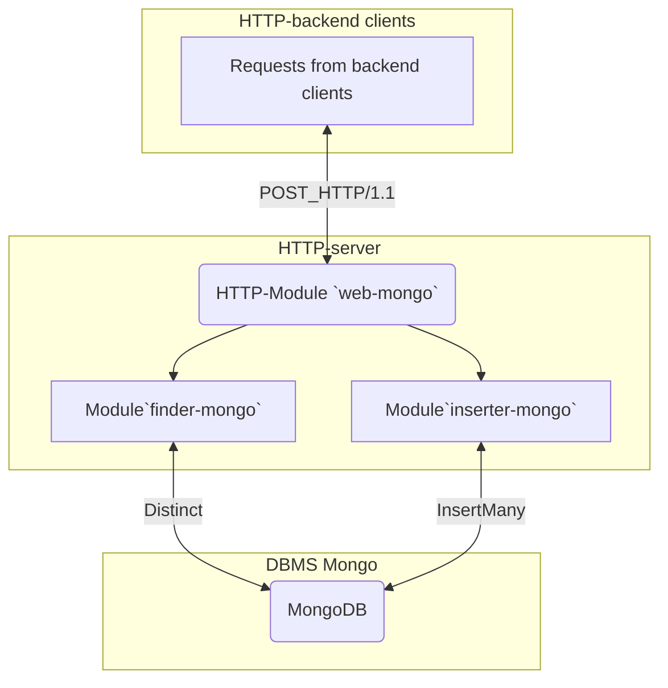

## Веб-сервис роутер обмена с mongodb   


### Содержание  
- [Сборка и тестирование](https://github.com/blablatov/web-mongo#сборка-и-тестирование)
- [Схема сервиса](https://github.com/blablatov/web-mongo#блок-схема-сервиса)


### Описание
Выполняет поиск и вставку документов в коллекции `topics` и `subscriptions`  
* Endpoint сервиса    
Точка доступа для клиентов к сервису реализована через `http`-запрос вида:  
```sh
http://localhost:8017/mgo/
```

* Парсинг POST-запроса  
Веб-сервис обрабатывает и демаршалирует тело запроса типа:  
```json
{
    "user_1": {
        "user_uuid": "str",
        "text": "str",
        "datetime": "timestamp"
    },
    "user_2": {
        "user_uuid": "str",
        "text": "str",
        "datetime": "timestamp"
    }
}
```  
* Поиск полученных sid в БД  
Модуль `finder-mongo.go` проверяет наличие параметра `tags` с полученными значениями `sid` в документах коллекции `users` БД `mongodb`. Если `sid` не существуют в `users`, выдается ошибка с описанием, в ответе на `POST`-запрос.    

* Вставка документов в `topics` и `subscriptions`  
Модуль `inserter-mongo` выполняет вставку документов для найденных `sid`. При успешном выполнении операций - возвращает OK, иначе - описание ошибки в ответе на `POST`-запрос.  


### Сборка и тестирование
[:arrow_up:Содержание](#Содержание)  

```sh
go build .
go run -v web-mongo

go test -v .
go test -bench=.
```  
Или выполнить `POST`-запрос из `Postman`:  
```sh
http://localhost:8017/mgo/
```
* Body:
```
{
    "user_1": {
        "user_uuid": "3e266244-0e23-4f2e-8cb5-b4d118054777",
        "text": "Hello!",
        "datetime": "timestamp"
    },
    "user_2": {
        "user_uuid": "3e266244-0e23-4f2e-8cb5-b4d118054888",
        "text": "Hello!",
        "datetime": "timestamp"
    }
}
```  
Проверить в `MongoDB` появление документов в коллекциях `topics` и `subscriptions`   


### Блок-схема сервиса
[:arrow_up:Содержание](#Содержание)  




